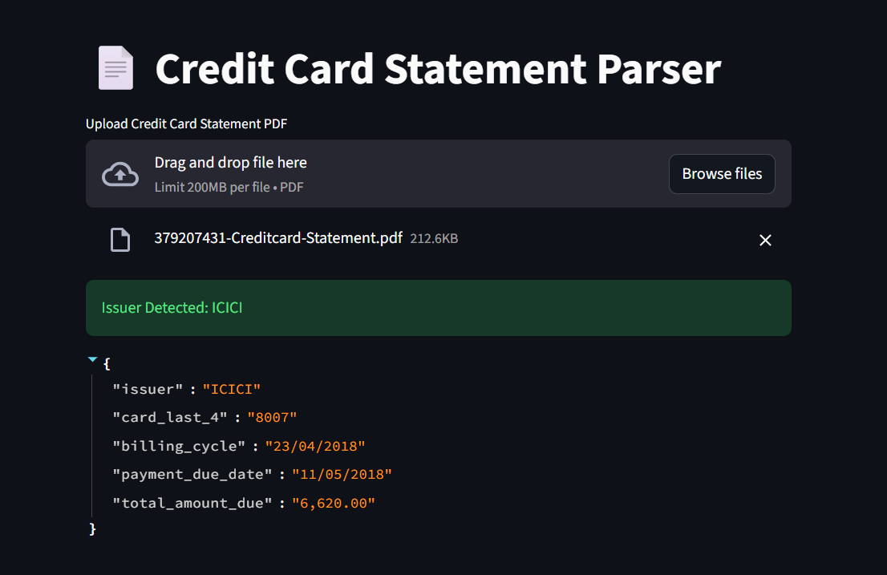

# Credit Card Statement Parser

## Objective
The goal of this project is to build a robust PDF parser that extracts key information from credit card statements across multiple credit card issuers while handling real-world PDF format variations.

---

## Features
- Upload credit card statement PDF via web UI
- Automatically detect card issuer
- Extract key billing information
- Handle real-world PDF layout inconsistencies
- Graceful handling of missing or unsupported fields
- Clean, structured JSON output

---

## Supported Credit Card Issuers
- HDFC Bank
- ICICI Bank
- Generic / Sample Credit Card Statements (CFPB-style)
- Architecture supports easy extension to SBI, Axis, Citibank

---

## Extracted Data Points
The system extracts the following 5 key data points:
1. Card Issuer
2. Card Last 4 Digits
3. Billing Cycle (or derived statement date)
4. Payment Due Date
5. Total Amount Due / Balance

---

## Tech Stack
- Python
- pdfplumber (PDF text extraction)
- Regex (pattern-based extraction)
- Streamlit (frontend UI)

---

## How It Works
1. User uploads a credit card statement PDF
2. Text is extracted from all PDF pages
3. Issuer is detected using keyword-based rules
4. Bank-specific or generic parser is selected
5. Flexible regex and fallback logic extract key fields
6. Results are displayed as structured JSON

---

## Handling Real-World PDF Formats
Credit card statements vary widely in layout, formatting, and structure.
This system handles real-world variability by:

- Normalizing extracted text (case, spacing)
- Using flexible pattern-based regex instead of rigid layouts
- Supporting values appearing above/below labels
- Handling merged headers and tabular formats
- Using safe extraction to prevent crashes
- Deriving values when fields are not explicitly present
- Falling back to generic parsing for unknown formats

When a field is not available in the statement, it is safely marked as unavailable instead of guessing.

---

## Limitations
- Scanned (image-based) PDFs are not supported (OCR can be added)
- Some issuers do not explicitly provide all fields (e.g., billing cycle)
- Parsing accuracy depends on PDF text quality

These limitations are inherent to real-world PDF documents.

---

## Running the Application

### Install dependencies
```bash
pip install -r requirements.txt
streamlit run app.py


## Application Output Demo

Below are sample outputs generated by the application after uploading real-world credit card statement PDFs.

### HDFC Credit Card Statement


### ICICI Credit Card Statement


### Generic / Sample Credit Card Statement

